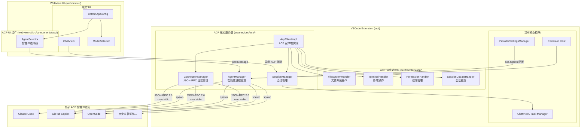
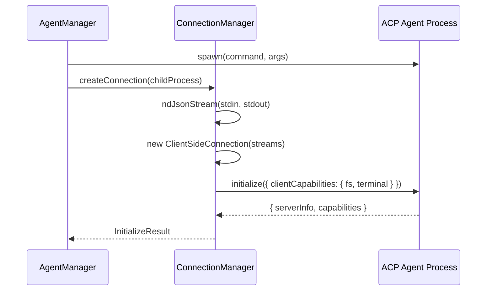
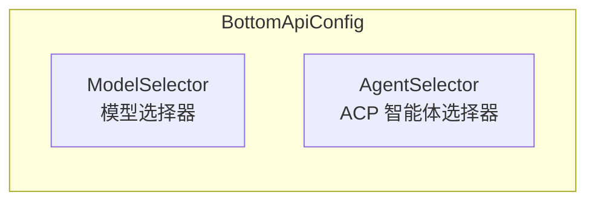
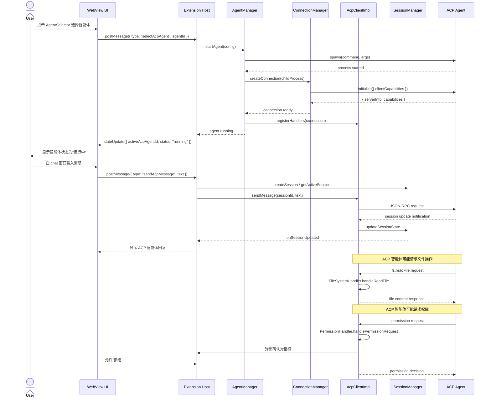
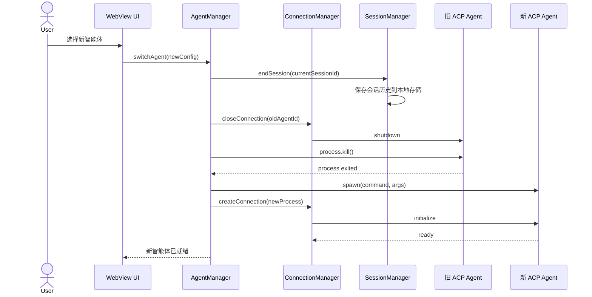

# ACP 客户端集成 - 设计文档

## 概述

本设计文档描述了在 CMBT Agent（基于 Kilo Code 的 VSCode 插件）中集成 ACP（Agent Client Protocol）协议客户端的技术方案。该功能使插件能够加载和使用符合 ACP 协议的外部智能体（如 OpenCode、Claude Code、GitHub Copilot、Gemini CLI 等）。

### 设计目标

1. **协议兼容性**: 完全实现 ACP 协议规范，支持 JSON-RPC 2.0 over stdio 通信
2. **模块化架构**: 参考 vscode-acp 的模块化设计，确保代码可维护性和可扩展性
3. **无缝集成**: 与现有 CMBT Agent 架构和 UI 无缝集成，复用现有 chat 窗口
4. **跨平台支持**: 支持 Windows、macOS 和 Linux 平台的智能体进程管理
5. **安全性**: 实现权限管理机制，保护用户代码和数据安全

### 技术栈

- **ACP SDK**: `@agentclientprotocol/sdk` (^0.14.1)
- **通信协议**: JSON-RPC 2.0 over stdio
- **进程管理**: Node.js `child_process.spawn`
- **流处理**: Web Streams API (`ndJsonStream`)
- **UI 框架**: React + TypeScript + Tailwind CSS
- **配置管理**: VSCode Configuration API

## 架构设计

### 系统架构图



### 分层架构说明

系统采用四层架构：

| 层级       | 目录                             | 职责                                     |
| ---------- | -------------------------------- | ---------------------------------------- |
| **UI 层**  | `webview-ui/src/components/acp/` | 智能体选择器、状态显示                   |
| **服务层** | `src/services/acp/`              | 进程管理、连接管理、会话管理、ACP 客户端 |
| **处理层** | `src/handlers/acp/`              | 文件系统、终端、权限、会话更新请求处理   |
| **协议层** | `@agentclientprotocol/sdk`       | ACP 协议实现、JSON-RPC 2.0               |

## 组件与接口设计

### 1. AgentManager（智能体管理器）

负责 ACP 智能体子进程的生命周期管理。

```typescript
// src/services/acp/AgentManager.ts
// cmbt-agent_change - new file

import { ChildProcess } from "child_process"

interface AcpAgentConfig {
	id: string
	name: string
	command: string
	args: string[]
	env?: Record<string, string>
}

interface AgentProcess {
	config: AcpAgentConfig
	process: ChildProcess
	status: "starting" | "running" | "stopped" | "error"
}

interface IAgentManager {
	/** 启动指定配置的智能体进程 */
	startAgent(config: AcpAgentConfig): Promise<AgentProcess>
	/** 停止指定智能体进程 */
	stopAgent(agentId: string): Promise<void>
	/** 切换到指定智能体（停止当前，启动新的） */
	switchAgent(config: AcpAgentConfig): Promise<AgentProcess>
	/** 获取当前活跃的智能体进程 */
	getActiveAgent(): AgentProcess | undefined
	/** 获取所有已配置的智能体列表 */
	getConfiguredAgents(): AcpAgentConfig[]
	/** 清理所有运行中的进程 */
	disposeAll(): Promise<void>
	/** 事件：智能体状态变更 */
	onAgentStatusChanged: vscode.Event<{ agentId: string; status: AgentProcess["status"] }>
}
```

**跨平台进程启动策略：**

```typescript
function getSpawnOptions(config: AcpAgentConfig): SpawnOptions {
	const isWindows = process.platform === "win32"
	if (isWindows) {
		return { shell: true, env: { ...process.env, ...config.env } }
	}
	// macOS/Linux: 使用登录 shell 以获取完整环境变量
	const loginShell = process.env.SHELL || "/bin/bash"
	return {
		shell: loginShell,
		env: { ...process.env, ...config.env },
	}
}
```

### 2. ConnectionManager（连接管理器）

负责建立和维护与 ACP 智能体的 JSON-RPC 2.0 通信连接。

```typescript
// src/services/acp/ConnectionManager.ts
// cmbt-agent_change - new file

import { ClientSideConnection } from "@agentclientprotocol/sdk"

interface IConnectionManager {
	/** 基于子进程的 stdio 创建连接 */
	createConnection(process: ChildProcess): Promise<ClientSideConnection>
	/** 发送 initialize 握手消息 */
	initialize(connection: ClientSideConnection): Promise<InitializeResult>
	/** 关闭连接 */
	closeConnection(agentId: string): Promise<void>
	/** 获取指定智能体的连接 */
	getConnection(agentId: string): ClientSideConnection | undefined
	/** 启用/禁用协议流量日志 */
	setTrafficLogging(enabled: boolean): void
	/** 事件：连接断开 */
	onConnectionLost: vscode.Event<{ agentId: string; reason: string }>
}

interface InitializeResult {
	serverInfo: { name: string; version: string }
	capabilities: Record<string, unknown>
}
```

**连接建立流程：**



### 3. AcpClientImpl（ACP 客户端实现）

核心客户端，协调各模块完成 ACP 协议交互。

```typescript
// src/services/acp/AcpClientImpl.ts
// cmbt-agent_change - new file

interface IAcpClient {
	/** 发送用户消息到 ACP 智能体 */
	sendMessage(sessionId: string, message: string): Promise<void>
	/** 创建新会话 */
	createSession(agentId: string): Promise<string>
	/** 结束会话 */
	endSession(sessionId: string): Promise<void>
	/** 注册请求处理器 */
	registerHandlers(connection: ClientSideConnection): void
	/** 获取当前会话 ID */
	getCurrentSessionId(): string | undefined
}
```

### 4. SessionManager（会话管理器）

管理与 ACP 智能体的会话状态和消息历史。

```typescript
// src/services/acp/SessionManager.ts
// cmbt-agent_change - new file

interface AcpMessage {
	role: "user" | "assistant"
	content: string
	timestamp: number
	source: "acp-agent"
	agentId: string
	agentName: string
}

interface AcpSession {
	id: string
	agentId: string
	agentName: string
	messages: AcpMessage[]
	createdAt: number
	updatedAt: number
	status: "active" | "ended"
}

interface ISessionManager {
	/** 创建新会话 */
	createSession(agentId: string, agentName: string): AcpSession
	/** 获取当前活跃会话 */
	getActiveSession(): AcpSession | undefined
	/** 添加消息到会话 */
	addMessage(sessionId: string, message: AcpMessage): void
	/** 更新会话状态（来自 ACP 通知） */
	updateSessionState(sessionId: string, update: Partial<AcpSession>): void
	/** 结束会话并保存到本地存储 */
	endSession(sessionId: string): Promise<void>
	/** 获取会话历史 */
	getSessionHistory(): AcpSession[]
	/** 事件：会话更新 */
	onSessionUpdated: vscode.Event<AcpSession>
}
```

### 5. Handler 模块

#### 5.1 FileSystemHandler（文件系统处理器）

```typescript
// src/handlers/acp/FileSystemHandler.ts
// cmbt-agent_change - new file

interface IFileSystemHandler {
	/** 处理文件读取请求 */
	handleReadFile(params: { path: string }): Promise<{ content: string }>
	/** 处理文件写入请求 */
	handleWriteFile(params: { path: string; content: string }): Promise<{ success: boolean }>
	/** 验证路径是否在工作区范围内 */
	validatePath(filePath: string): boolean
}
```

#### 5.2 TerminalHandler（终端处理器）

```typescript
// src/handlers/acp/TerminalHandler.ts
// cmbt-agent_change - new file

interface ITerminalHandler {
	/** 创建新终端 */
	handleCreateTerminal(params: { name?: string; cwd?: string }): Promise<{ terminalId: string }>
	/** 获取终端输出 */
	handleGetOutput(params: { terminalId: string }): Promise<{ output: string }>
	/** 等待终端退出 */
	handleWaitForExit(params: { terminalId: string }): Promise<{ exitCode: number }>
	/** 终止终端 */
	handleKillTerminal(params: { terminalId: string }): Promise<void>
	/** 释放终端资源 */
	handleDisposeTerminal(params: { terminalId: string }): Promise<void>
}
```

#### 5.3 PermissionHandler（权限处理器）

```typescript
// src/handlers/acp/PermissionHandler.ts
// cmbt-agent_change - new file

interface PermissionDecision {
	allowed: boolean
	remember: boolean
}

interface IPermissionHandler {
	/** 处理权限请求，弹出确认对话框 */
	handlePermissionRequest(params: {
		operation: string
		resource: string
		description: string
	}): Promise<PermissionDecision>
	/** 检查缓存的权限决策 */
	checkCachedDecision(operation: string, resource: string): PermissionDecision | undefined
	/** 清除缓存的权限决策 */
	clearCachedDecisions(): void
}
```

#### 5.4 SessionUpdateHandler（会话更新处理器）

```typescript
// src/handlers/acp/SessionUpdateHandler.ts
// cmbt-agent_change - new file

interface ISessionUpdateHandler {
	/** 处理来自 ACP 智能体的会话更新通知 */
	handleSessionUpdate(params: { sessionId: string; messages?: AcpMessage[]; status?: string }): void
}
```

### 6. AgentSelector（智能体选择器 UI 组件）

```typescript
// webview-ui/src/components/acp/AgentSelector.tsx
// cmbt-agent_change - new file

interface AgentSelectorProps {
	agents: AcpAgentConfig[]
	activeAgentId: string | undefined
	activeAgentStatus: "starting" | "running" | "stopped" | "error" | undefined
	onSelectAgent: (agentId: string) => void
}
```

**UI 集成位置：** 在 `BottomApiConfig.tsx` 中添加 AgentSelector，与 ModelSelector 并列显示。



## 数据模型

### 智能体配置（VSCode Settings）

```jsonc
// package.json contributes.configuration
{
	"acp.agents": {
		"type": "array",
		"default": [
			{
				"id": "claude-code",
				"name": "Claude Code",
				"command": "claude",
				"args": ["--acp"],
				"env": {},
			},
			{
				"id": "github-copilot",
				"name": "GitHub Copilot",
				"command": "github-copilot",
				"args": ["--acp"],
				"env": {},
			},
			{
				"id": "opencode",
				"name": "OpenCode",
				"command": "opencode",
				"args": ["--acp"],
				"env": {},
			},
		],
		"items": {
			"type": "object",
			"required": ["id", "name", "command"],
			"properties": {
				"id": { "type": "string", "description": "智能体唯一标识" },
				"name": { "type": "string", "description": "智能体显示名称" },
				"command": { "type": "string", "description": "启动命令" },
				"args": { "type": "array", "items": { "type": "string" }, "description": "启动参数" },
				"env": { "type": "object", "description": "环境变量" },
			},
		},
	},
}
```

### ACP 会话数据模型

```typescript
// 存储在 globalState 中的会话历史
interface AcpSessionStorage {
	sessions: AcpSession[]
	maxSessions: number // 默认 50
}

// 单条会话
interface AcpSession {
	id: string // UUID
	agentId: string // 对应 AcpAgentConfig.id
	agentName: string // 对应 AcpAgentConfig.name
	messages: AcpMessage[] // 消息列表
	createdAt: number // 创建时间戳
	updatedAt: number // 最后更新时间戳
	status: "active" | "ended"
}

// 单条消息
interface AcpMessage {
	role: "user" | "assistant"
	content: string
	timestamp: number
	source: "acp-agent" // 标识消息来源
	agentId: string
	agentName: string
}
```

### WebView 状态扩展

```typescript
// 扩展 ExtensionState 以包含 ACP 状态
interface AcpState {
	acpAgents: AcpAgentConfig[] // 已配置的智能体列表
	activeAcpAgentId: string | undefined // 当前活跃智能体 ID
	activeAcpAgentStatus: "starting" | "running" | "stopped" | "error" | undefined
	isAcpMode: boolean // 是否处于 ACP 模式
}
```

### 核心交互序列图

#### 用户选择并使用 ACP 智能体的完整流程



#### 智能体切换流程



## 错误处理策略

### 错误分类与处理

| 错误类型         | 场景                       | 处理策略                                           |
| ---------------- | -------------------------- | -------------------------------------------------- |
| **进程启动失败** | 智能体命令不存在、权限不足 | 记录详细错误日志，向用户显示友好提示，建议检查配置 |
| **连接建立失败** | 握手超时、协议不兼容       | 终止进程，记录错误，提示用户检查智能体版本         |
| **通信中断**     | 进程崩溃、网络问题         | 触发重连机制（最多3次），失败后通知用户并清理资源  |
| **文件操作失败** | 路径不存在、权限不足       | 返回描述性错误给智能体，记录操作日志               |
| **权限被拒绝**   | 用户拒绝敏感操作           | 返回拒绝响应给智能体，不中断会话                   |
| **会话状态异常** | 会话 ID 不匹配、状态不一致 | 记录警告日志，尝试恢复或创建新会话                 |

### 错误日志系统

```typescript
// src/services/acp/AcpLogger.ts
// cmbt-agent_change - new file

enum AcpLogLevel {
	ERROR = "error",
	WARN = "warn",
	INFO = "info",
	DEBUG = "debug",
	TRACE = "trace", // 协议流量日志
}

interface IAcpLogger {
	error(message: string, error?: Error, context?: Record<string, unknown>): void
	warn(message: string, context?: Record<string, unknown>): void
	info(message: string, context?: Record<string, unknown>): void
	debug(message: string, context?: Record<string, unknown>): void
	trace(direction: "send" | "receive", message: unknown): void
	setLevel(level: AcpLogLevel): void
}
```

**日志输出通道：** 在 VSCode 输出面板创建专用的 "ACP Client" 通道。

### 重连机制

```typescript
interface ReconnectionConfig {
	maxAttempts: 3
	initialDelay: 1000 // ms
	maxDelay: 10000 // ms
	backoffMultiplier: 2
}

// 指数退避重连策略
async function reconnectWithBackoff(agentId: string, config: AcpAgentConfig, attempt: number = 1): Promise<void> {
	if (attempt > ReconnectionConfig.maxAttempts) {
		throw new Error(`Failed to reconnect after ${attempt - 1} attempts`)
	}

	const delay = Math.min(
		ReconnectionConfig.initialDelay * Math.pow(ReconnectionConfig.backoffMultiplier, attempt - 1),
		ReconnectionConfig.maxDelay,
	)

	await sleep(delay)

	try {
		await startAgent(config)
	} catch (error) {
		return reconnectWithBackoff(agentId, config, attempt + 1)
	}
}
```

### 资源清理

```typescript
// 确保所有资源在扩展关闭时被正确清理
class AcpResourceManager {
	private disposables: vscode.Disposable[] = []

	register(disposable: vscode.Disposable): void {
		this.disposables.push(disposable)
	}

	async dispose(): Promise<void> {
		// 1. 结束所有活跃会话
		await sessionManager.endAllSessions()

		// 2. 关闭所有连接
		await connectionManager.closeAllConnections()

		// 3. 终止所有进程
		await agentManager.disposeAll()

		// 4. 清理其他资源
		for (const disposable of this.disposables) {
			disposable.dispose()
		}
		this.disposables = []
	}
}
```

## 测试策略

### 双重测试方法

本功能采用**单元测试**和**基于属性的测试**相结合的策略：

- **单元测试**: 验证具体示例、边界情况和错误条件
- **基于属性的测试**: 验证跨所有输入的通用属性

两者互补，共同确保全面覆盖：

- 单元测试捕获具体的 bug
- 基于属性的测试验证通用正确性

### 测试框架与工具

- **测试框架**: Vitest
- **属性测试库**: fast-check (JavaScript/TypeScript 的属性测试库)
- **Mock 工具**: vitest mock functions
- **最小迭代次数**: 每个属性测试至少 100 次迭代

### 测试覆盖范围

#### 1. AgentManager 测试

**单元测试：**

- 成功启动智能体进程
- 跨平台进程启动选项（Windows vs macOS/Linux）
- 进程启动失败处理
- 智能体切换流程
- 进程清理和资源释放

**属性测试：**

- 标签格式: `Feature: acp-client-integration, Property {number}: {property_text}`
- 最小迭代次数: 100

#### 2. ConnectionManager 测试

**单元测试：**

- 成功建立 JSON-RPC 连接
- Initialize 握手消息格式
- 连接超时处理
- 连接断开检测

**属性测试：**

- 标签格式: `Feature: acp-client-integration, Property {number}: {property_text}`

#### 3. FileSystemHandler 测试

**单元测试：**

- 读取存在的文件
- 写入文件到有效路径
- 路径验证（工作区内/外）
- 文件不存在错误
- 权限错误处理

**属性测试：**

- 标签格式: `Feature: acp-client-integration, Property {number}: {property_text}`

#### 4. TerminalHandler 测试

**单元测试：**

- 创建终端实例
- 捕获终端输出
- 终端退出码获取
- 终端终止和清理

#### 5. SessionManager 测试

**单元测试：**

- 创建新会话
- 添加消息到会话
- 会话状态更新
- 会话历史持久化

**属性测试：**

- 标签格式: `Feature: acp-client-integration, Property {number}: {property_text}`

#### 6. UI 组件测试

**单元测试：**

- AgentSelector 渲染
- 智能体选择交互
- 状态显示（运行中/已停止/错误）
- 与 BottomApiConfig 集成

### 集成测试

```typescript
// 端到端流程测试
describe("ACP Integration E2E", () => {
	it("should complete full agent interaction flow", async () => {
		// 1. 启动智能体
		const agent = await agentManager.startAgent(mockConfig)
		expect(agent.status).toBe("running")

		// 2. 创建会话
		const session = await acpClient.createSession(agent.config.id)
		expect(session).toBeDefined()

		// 3. 发送消息
		await acpClient.sendMessage(session.id, "Hello")

		// 4. 验证会话更新
		const updatedSession = sessionManager.getActiveSession()
		expect(updatedSession?.messages.length).toBeGreaterThan(0)

		// 5. 清理
		await agentManager.stopAgent(agent.config.id)
	})
})
```

### Mock 策略

```typescript
// Mock ACP 智能体进程用于测试
class MockAcpAgent {
	private stdin: Writable
	private stdout: Readable

	constructor() {
		this.stdin = new PassThrough()
		this.stdout = new PassThrough()
	}

	// 模拟接收消息并响应
	simulateResponse(request: unknown, response: unknown): void {
		this.stdin.on("data", (data) => {
			const message = JSON.parse(data.toString())
			if (message.method === request) {
				this.stdout.write(JSON.stringify(response))
			}
		})
	}

	getProcess(): Partial<ChildProcess> {
		return {
			stdin: this.stdin,
			stdout: this.stdout,
			kill: vi.fn(),
		}
	}
}
```

## 正确性属性

_属性是一个特征或行为,应该在系统的所有有效执行中保持为真——本质上是关于系统应该做什么的形式化陈述。属性作为人类可读规范和机器可验证正确性保证之间的桥梁。_

### 属性 1: 配置存储往返一致性

*对于任何*有效的 ACP 智能体配置列表,将其存储到 VSCode 配置然后读取回来,应该返回相同的配置列表。

**验证需求: 2.1**

### 属性 2: 配置验证正确性

*对于任何*配置对象,验证器应该接受它当且仅当它包含必需的字段 (command, args, env)。

**验证需求: 2.2**

### 属性 3: 进程启动一致性

*对于任何*有效的智能体配置,选择该智能体应该导致使用正确的命令和参数启动子进程。

**验证需求: 3.1**

### 属性 4: 跨平台进程选项正确性

*对于任何*平台值 (Windows, macOS, Linux),spawn 选项应该匹配该平台的预期配置 (Windows 使用 shell:true,macOS/Linux 使用登录 shell)。

**验证需求: 3.2**

### 属性 5: 进程生命周期清理完整性

*对于任何*运行中的智能体进程集合,调用清理操作 (切换智能体或扩展关闭) 应该终止所有相关进程。

**验证需求: 3.4, 3.5**

### 属性 6: 连接断开恢复机制

*对于任何*连接丢失事件,系统应该尝试重连或通知用户。

**验证需求: 4.5**

### 属性 7: 文件系统操作往返一致性

*对于任何*工作区内的有效文件路径和内容,写入文件然后读取应该返回相同的内容。

**验证需求: 5.1, 5.2**

### 属性 8: 文件路径验证边界正确性

*对于任何*文件路径,验证器应该接受工作区内的路径并拒绝工作区外的路径。

**验证需求: 5.3**

### 属性 9: 权限决策记录和返回

*对于任何*权限决策 (允许或拒绝),该决策应该被记录并返回给 ACP 智能体。

**验证需求: 7.2, 7.4**

### 属性 10: 权限决策缓存一致性

*对于任何*带有"记住"标志的权限决策,对相同操作的后续请求应该返回缓存的决策而不显示对话框。

**验证需求: 7.3**

### 属性 11: 会话创建唯一性

*对于任何*智能体,开始对话应该创建一个具有唯一 ID 的新会话。

**验证需求: 8.1**

### 属性 12: 会话消息历史完整性

*对于任何*添加到会话的消息序列,会话的消息列表应该按顺序包含所有消息,并且会话状态更新应该正确反映。

**验证需求: 8.2, 8.3**

### 属性 13: 会话持久化往返一致性

*对于任何*会话,结束会话然后从存储中检索应该返回相同的会话数据。

**验证需求: 8.4**

### 属性 14: 智能体选择器渲染完整性

*对于任何*已配置的智能体列表,选择器应该渲染所有智能体。

**验证需求: 9.2**

### 属性 15: 智能体选择交互正确性

*对于任何*列表中的智能体,点击它应该触发选择回调并传递正确的智能体 ID。

**验证需求: 9.3**

### 属性 16: 智能体状态显示一致性

*对于任何*智能体状态值 (starting, running, stopped, error),选择器应该显示对应的状态指示器。

**验证需求: 9.4**

### 属性 17: 模式切换状态一致性

*对于任何*在 Kilo Code 模型和 ACP 智能体之间的切换序列,系统应该正确切换模式状态。

**验证需求: 10.2**

### 属性 18: ACP 消息源标识正确性

*对于任何*来自 ACP 智能体的消息,该消息应该将 source 字段设置为 "acp-agent"。

**验证需求: 10.3**

### 属性 19: 错误日志记录完整性

*对于任何*ACP 相关错误,日志记录器应该被调用并记录错误详情。

**验证需求: 3.3, 11.1**

### 属性 20: 日志级别过滤正确性

*对于任何*日志级别设置,日志记录器应该相应地过滤消息 (只记录等于或高于设置级别的消息)。

**验证需求: 11.2**

### 属性 21: 代码标记一致性

*对于任何*新增的 ACP 相关代码文件,文件开头应该包含 `// cmbt-agent_change - new file` 标记。

**验证需求: 12.1**
