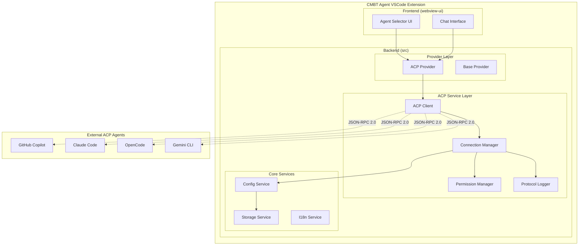

# ACP协议支持技术设计文档

## 概述

本设计文档详细描述了在CMBT Agent VSCode插件中实现ACP（Agent Client Protocol）协议支持的技术架构。该功能将使CMBT Agent能够作为ACP客户端连接和管理支持ACP协议的外部智能体服务，如OpenCode、Claude Code、GitHub Copilot等。

### 设计目标

1. **协议兼容性**: 完全实现ACP协议规范，支持JSON-RPC 2.0 over stdio通信
2. **架构集成**: 与现有Kilo Code架构无缝集成，遵循现有的provider模式
3. **用户体验**: 提供统一的智能体选择和管理界面
4. **性能优化**: 支持多智能体并发连接，优化资源使用
5. **安全性**: 实现权限管理和安全连接机制
6. **国际化**: 支持中文等多语言界面

### 核心特性

- ACP协议客户端实现
- 智能体配置和生命周期管理
- UI集成（智能体选择器）
- 聊天界面集成
- 权限管理系统
- 协议流量日志记录
- 错误处理和恢复机制
- 配置持久化

## 架构设计

### 系统架构图



### 分层架构

1. **UI层**: React组件，负责用户交互
2. **Provider层**: 实现标准provider接口，桥接ACP协议
3. **Service层**: 核心ACP服务实现
4. **Protocol层**: ACP协议通信实现
5. **Storage层**: 配置和状态持久化

## 组件设计

### 1. ACP Client (核心协议客户端)

**位置**: `src/services/acp/client/ACPClient.ts`

**职责**:

- 实现ACP协议规范的所有核心消息类型
- 管理与ACP智能体的WebSocket/HTTP连接
- 处理协议握手和身份验证
- 消息序列化/反序列化
- 连接状态管理

**核心接口**:

```typescript
interface ACPClient {
	connect(config: ACPAgentConfig): Promise<void>
	disconnect(agentId: string): Promise<void>
	sendMessage(agentId: string, message: ACPMessage): Promise<ACPResponse>
	subscribe(agentId: string, callback: (message: ACPMessage) => void): void
	getConnectionStatus(agentId: string): ConnectionStatus
}
```

### 2. Connection Manager (连接管理器)

**位置**: `src/services/acp/ConnectionManager.ts`

**职责**:

- 管理多个ACP智能体的连接
- 连接池管理和资源优化
- 自动重连和错误恢复
- 连接状态监控
- 生命周期管理

**核心功能**:

- 添加/编辑/删除智能体配置
- 验证连接参数
- 并发连接管理
- 空闲连接自动断开
- 优雅关闭机制

### 3. ACP Provider (提供商实现)

**位置**: `src/api/providers/acp.ts`

**职责**:

- 实现BaseProvider接口
- 将ACP协议消息转换为标准provider格式
- 集成到现有provider系统
- 支持工具调用和文件操作

**实现模式**:

```typescript
export class ACPHandler extends BaseProvider {
	constructor(private connectionManager: ConnectionManager) {
		super()
	}

	async *createMessage(
		systemPrompt: string,
		messages: Anthropic.Messages.MessageParam[],
		metadata?: ApiHandlerCreateMessageMetadata,
	): ApiStream {
		// 转换消息格式并发送到ACP智能体
		// 处理流式响应
	}
}
```

### 4. Agent Selector UI (智能体选择器)

**位置**: `webview-ui/src/components/acp/AgentSelector.tsx`

**职责**:

- 显示已配置的ACP智能体列表
- 智能体状态指示（连接中、已连接、断开）
- 智能体切换功能
- 中文界面支持

**集成点**: 渲染到`BottomApiConfig`组件的`acp-agent`容器中

### 5. Permission Manager (权限管理器)

**位置**: `src/services/acp/PermissionManager.ts`

**职责**:

- 为每个ACP智能体维护权限配置
- 文件访问权限控制（读取、写入、执行）
- 网络访问权限控制
- 权限请求确认对话框
- 权限操作日志记录

### 6. Protocol Logger (协议日志记录器)

**位置**: `src/services/acp/ProtocolLogger.ts`

**职责**:

- 记录所有ACP协议消息（发送和接收）
- 包含时间戳、智能体标识和消息内容
- 支持日志级别配置
- 日志查看和导出功能
- 调试模式详细记录

## ACP协议实现设计

### 协议规范

基于JSON-RPC 2.0 over stdio的ACP协议实现，支持以下核心消息类型：

1. **握手消息**: 建立连接和协议版本协商
2. **认证消息**: 身份验证和授权
3. **任务消息**: 发送编程任务和接收响应
4. **工具调用**: 文件操作、代码执行等工具调用
5. **状态消息**: 连接状态和健康检查
6. **错误消息**: 错误报告和异常处理

### 消息格式

```typescript
interface ACPMessage {
	jsonrpc: "2.0"
	id?: string | number
	method: string
	params?: any
}

interface ACPResponse {
	jsonrpc: "2.0"
	id: string | number
	result?: any
	error?: {
		code: number
		message: string
		data?: any
	}
}
```

### 连接管理

```typescript
interface ACPConnection {
	id: string
	agentId: string
	status: "connecting" | "connected" | "disconnected" | "error"
	transport: "websocket" | "http" | "stdio"
	endpoint: string
	lastActivity: Date
	retryCount: number
}
```

### 预配置智能体

系统将预配置以下常用ACP智能体：

1. **GitHub Copilot**

    - 端点: `copilot://agent`
    - 认证: GitHub token
    - 功能: 代码补全、解释、重构

2. **Claude Code**

    - 端点: `claude-code://agent`
    - 认证: Anthropic API key
    - 功能: 代码分析、生成、调试

3. **Gemini CLI**

    - 端点: `gemini-cli://agent`
    - 认证: Google API key
    - 功能: 代码生成、文档编写

4. **OpenCode**
    - 端点: `opencode://agent`
    - 认证: OpenAI API key
    - 功能: 通用编程助手

## UI组件设计

### Agent Selector组件

**组件结构**:

```typescript
interface AgentSelectorProps {
	agents: ACPAgent[]
	activeAgent?: string
	onAgentSelect: (agentId: string) => void
	onAgentConfig: (agentId: string) => void
}

interface ACPAgent {
	id: string
	name: string
	status: ConnectionStatus
	icon?: string
	description?: string
}
```

**样式设计**:

- 使用Tailwind CSS类
- 遵循VSCode主题变量
- 响应式设计
- 状态指示器（绿色=已连接，黄色=连接中，红色=断开）

### 聊天界面集成

**消息路由**:

- 检测当前选中的智能体类型
- ACP智能体消息路由到ACP Provider
- 非ACP智能体使用现有provider系统

**智能体标识**:

- 在消息界面显示当前使用的智能体名称
- 连接状态实时更新
- 断开连接时显示警告提示

## 数据模型设计

### ACP智能体配置

```typescript
interface ACPAgentConfig {
	id: string
	name: string
	displayName: string
	description?: string
	endpoint: string
	transport: "websocket" | "http" | "stdio"
	authentication: {
		type: "token" | "oauth" | "none"
		credentials?: Record<string, string>
	}
	permissions: {
		fileAccess: "none" | "read" | "write" | "full"
		networkAccess: boolean
		shellAccess: boolean
	}
	settings: {
		autoConnect: boolean
		idleTimeout: number
		retryAttempts: number
		retryDelay: number
	}
	metadata: {
		version: string
		capabilities: string[]
		created: Date
		lastUsed?: Date
	}
}
```

### 连接状态

```typescript
interface ConnectionStatus {
	status: "connecting" | "connected" | "disconnected" | "error"
	lastConnected?: Date
	lastError?: string
	latency?: number
	messageCount: number
}
```

### 权限配置

```typescript
interface PermissionConfig {
	agentId: string
	permissions: {
		files: {
			read: string[] // 允许读取的路径模式
			write: string[] // 允许写入的路径模式
			execute: string[] // 允许执行的路径模式
		}
		network: {
			allowedHosts: string[]
			blockedHosts: string[]
		}
		system: {
			shellAccess: boolean
			environmentAccess: boolean
		}
	}
	auditLog: PermissionAuditEntry[]
}

interface PermissionAuditEntry {
	timestamp: Date
	action: string
	resource: string
	granted: boolean
	reason?: string
}
```

## API接口设计

### ACP Service API

```typescript
// 主要服务接口
interface ACPService {
	// 智能体管理
	listAgents(): Promise<ACPAgent[]>
	addAgent(config: ACPAgentConfig): Promise<void>
	updateAgent(id: string, config: Partial<ACPAgentConfig>): Promise<void>
	removeAgent(id: string): Promise<void>

	// 连接管理
	connect(agentId: string): Promise<void>
	disconnect(agentId: string): Promise<void>
	getConnectionStatus(agentId: string): ConnectionStatus

	// 消息处理
	sendMessage(agentId: string, message: any): Promise<any>
	subscribeToMessages(agentId: string, callback: MessageCallback): void

	// 权限管理
	requestPermission(agentId: string, permission: PermissionRequest): Promise<boolean>
	getPermissions(agentId: string): PermissionConfig
	updatePermissions(agentId: string, permissions: Partial<PermissionConfig>): Promise<void>
}
```

### Extension Message API

```typescript
// 扩展消息类型
interface ACPExtensionMessage {
	type: "acp-agent-select" | "acp-agent-config" | "acp-connection-status"
	agentId?: string
	data?: any
}

// Webview消息类型
interface ACPWebviewMessage {
	type: "acp-agents-list" | "acp-agent-status-update" | "acp-permission-request"
	agents?: ACPAgent[]
	status?: ConnectionStatus
	permission?: PermissionRequest
}
```

### Provider Integration API

```typescript
// Provider接口扩展
interface ACPProviderOptions extends ApiHandlerOptions {
	agentId: string
	connectionManager: ConnectionManager
	permissionManager: PermissionManager
}

// 消息转换接口
interface MessageTransformer {
	toACPMessage(message: Anthropic.Messages.MessageParam): ACPMessage
	fromACPResponse(response: ACPResponse): Anthropic.Messages.MessageParam
}
```

## 错误处理设计

### 错误分类

1. **连接错误**

    - 网络连接失败
    - 协议握手失败
    - 认证失败
    - 超时错误

2. **协议错误**

    - 消息格式错误
    - 版本不兼容
    - 不支持的方法
    - 参数验证失败

3. **权限错误**

    - 访问被拒绝
    - 权限不足
    - 资源不可用

4. **系统错误**
    - 内存不足
    - 文件系统错误
    - 配置错误

### 错误处理策略

```typescript
interface ErrorHandler {
	handleConnectionError(error: ConnectionError): Promise<void>
	handleProtocolError(error: ProtocolError): Promise<void>
	handlePermissionError(error: PermissionError): Promise<void>
	handleSystemError(error: SystemError): Promise<void>
}

class ACPErrorHandler implements ErrorHandler {
	async handleConnectionError(error: ConnectionError): Promise<void> {
		// 自动重连逻辑
		// 用户通知
		// 回退到默认provider
	}

	async handleProtocolError(error: ProtocolError): Promise<void> {
		// 协议版本协商
		// 错误消息本地化
		// 用户友好提示
	}

	// ... 其他错误处理方法
}
```

### 重连机制

```typescript
interface RetryConfig {
	maxAttempts: number
	baseDelay: number
	maxDelay: number
	backoffMultiplier: number
	jitter: boolean
}

class ConnectionRetryManager {
	async retryConnection(agentId: string, config: RetryConfig): Promise<boolean> {
		// 指数退避重连
		// 连接状态更新
		// 用户通知
	}
}
```

## 安全性设计

### 认证机制

1. **Token认证**: 支持API token、OAuth token
2. **证书认证**: 支持客户端证书
3. **无认证**: 本地开发环境支持

### 权限控制

1. **文件系统权限**

    - 基于路径模式的访问控制
    - 读取、写入、执行权限分离
    - 敏感目录保护

2. **网络权限**

    - 允许/阻止主机列表
    - 端口访问控制
    - 代理设置支持

3. **系统权限**
    - Shell命令执行控制
    - 环境变量访问限制
    - 进程管理权限

### 数据保护

```typescript
interface SecurityManager {
	encryptCredentials(credentials: Record<string, string>): string
	decryptCredentials(encrypted: string): Record<string, string>
	validatePermission(agentId: string, resource: string, action: string): boolean
	auditAccess(agentId: string, resource: string, action: string, granted: boolean): void
}
```

### 沙箱机制

- ACP智能体运行在受限环境中
- 文件访问通过权限管理器验证
- 网络请求通过代理过滤
- 系统调用监控和限制

## 性能优化设计

### 连接池管理

```typescript
interface ConnectionPool {
	maxConnections: number
	idleTimeout: number
	connectionReuse: boolean

	acquire(agentId: string): Promise<ACPConnection>
	release(connection: ACPConnection): void
	cleanup(): void
}
```

### 消息队列

```typescript
interface MessageQueue {
	enqueue(agentId: string, message: ACPMessage): void
	dequeue(agentId: string): ACPMessage | null
	flush(agentId: string): ACPMessage[]
	size(agentId: string): number
}
```

### 资源监控

```typescript
interface ResourceMonitor {
	getMemoryUsage(): MemoryUsage
	getConnectionCount(): number
	getMessageRate(): number

	onResourceThreshold(callback: (metric: string, value: number) => void): void
}
```

### 缓存策略

1. **配置缓存**: 智能体配置本地缓存
2. **连接缓存**: 连接状态缓存
3. **消息缓存**: 最近消息缓存用于重发
4. **权限缓存**: 权限决策结果缓存

## 国际化设计

### 多语言支持

基于现有i18n框架，添加ACP相关翻译：

**翻译文件结构**:

```
webview-ui/src/i18n/locales/
├── en/acp.json
├── zh-CN/acp.json
├── zh-TW/acp.json
└── ...
```

**翻译键设计**:

```json
{
	"acp": {
		"agentSelector": {
			"title": "ACP智能体",
			"noAgents": "未配置智能体",
			"connecting": "连接中...",
			"connected": "已连接",
			"disconnected": "已断开",
			"error": "连接错误"
		},
		"permissions": {
			"fileAccess": "文件访问权限",
			"networkAccess": "网络访问权限",
			"confirmDialog": "智能体 {{agentName}} 请求 {{permission}} 权限，是否允许？"
		},
		"errors": {
			"connectionFailed": "连接智能体失败: {{error}}",
			"protocolError": "协议错误: {{error}}",
			"permissionDenied": "权限被拒绝: {{resource}}"
		}
	}
}
```

### 本地化组件

```typescript
// 使用翻译的组件示例
const AgentSelector: React.FC = () => {
  const { t } = useTranslation('acp')

  return (
    <div className="acp-agent-selector">
      <h3>{t('agentSelector.title')}</h3>
      {agents.length === 0 && (
        <p>{t('agentSelector.noAgents')}</p>
      )}
    </div>
  )
}
```

### 错误消息本地化

```typescript
class LocalizedErrorHandler {
	formatError(error: ACPError, locale: string): string {
		const i18n = getI18nInstance(locale)

		switch (error.type) {
			case "connection":
				return i18n.t("acp.errors.connectionFailed", { error: error.message })
			case "protocol":
				return i18n.t("acp.errors.protocolError", { error: error.message })
			case "permission":
				return i18n.t("acp.errors.permissionDenied", { resource: error.resource })
			default:
				return error.message
		}
	}
}
```

## 测试策略

### 单元测试

1. **ACP Client测试**

    - 协议消息序列化/反序列化
    - 连接状态管理
    - 错误处理

2. **Connection Manager测试**

    - 连接池管理
    - 重连机制
    - 配置验证

3. **Permission Manager测试**
    - 权限验证逻辑
    - 审计日志记录
    - 权限配置管理

### 集成测试

1. **Provider集成测试**

    - 与现有provider系统集成
    - 消息路由正确性
    - 工具调用支持

2. **UI集成测试**
    - 智能体选择器功能
    - 聊天界面集成
    - 状态同步

### 端到端测试

1. **完整流程测试**

    - 智能体配置 → 连接 → 消息交互 → 断开
    - 权限请求和确认流程
    - 错误恢复流程

2. **性能测试**
    - 多智能体并发连接
    - 消息吞吐量测试
    - 内存使用监控

### Mock智能体

```typescript
// 测试用Mock ACP智能体
class MockACPAgent {
	constructor(private config: MockAgentConfig) {}

	async handleMessage(message: ACPMessage): Promise<ACPResponse> {
		// 模拟智能体响应
		return {
			jsonrpc: "2.0",
			id: message.id,
			result: this.generateMockResponse(message),
		}
	}

	private generateMockResponse(message: ACPMessage): any {
		// 根据消息类型生成模拟响应
	}
}
```

## 正确性属性

_属性是在系统的所有有效执行中都应该成立的特征或行为——本质上是关于系统应该做什么的正式陈述。属性作为人类可读规范和机器可验证正确性保证之间的桥梁。_

基于需求文档中的验收标准，以下属性定义了ACP协议支持功能的正确性要求：

### 属性 1: ACP协议消息处理

*对于任何*有效的ACP协议消息，客户端应该能够正确解析消息并转换为内部格式，然后将内部格式转换回ACP格式时应该保持等价性

**验证需求: 1.1, 1.4**

### 属性 2: 多智能体连接管理

*对于任何*智能体配置集合，ACP客户端应该能够同时维护与所有配置智能体的连接，且每个连接的状态应该独立管理

**验证需求: 1.5, 2.4**

### 属性 3: 配置持久化往返

*对于任何*有效的智能体配置，保存到VSCode设置后再加载回来应该得到等价的配置对象

**验证需求: 2.1, 2.3, 10.1, 10.2, 10.3**

### 属性 4: 连接参数验证

*对于任何*无效的连接参数，连接管理器应该拒绝配置并返回适当的错误信息

**验证需求: 2.2**

### 属性 5: 连接生命周期管理

*对于任何*智能体连接，执行连接→断开→重连的操作序列应该使连接恢复到可用状态

**验证需求: 6.1, 6.2, 6.3, 9.1**

### 属性 6: UI状态同步

*对于任何*智能体状态变化（连接、断开、错误），UI组件应该反映正确的状态显示

**验证需求: 3.2, 3.3, 3.4, 5.4, 5.5**

### 属性 7: 消息路由正确性

*对于任何*选定的ACP智能体，发送到聊天界面的消息应该路由到正确的智能体并返回该智能体的响应

**验证需求: 5.1, 5.2**

### 属性 8: 权限管理完整性

*对于任何*智能体的权限请求，权限管理器应该正确验证权限、记录审计日志，并且只有被授权的操作才能执行

**验证需求: 7.1, 7.2, 7.3, 7.4, 7.5**

### 属性 9: 协议日志记录完整性

*对于任何*ACP协议消息（发送或接收），协议日志记录器应该记录包含时间戳、智能体标识和消息内容的完整日志条目

**验证需求: 8.1, 8.2, 8.3, 8.4, 8.5**

### 属性 10: 错误处理和恢复

*对于任何*连接错误或协议错误，系统应该显示用户友好的错误消息，执行适当的重试逻辑（在限制范围内），并在必要时回退到默认提供商

**验证需求: 9.2, 9.3, 9.4, 9.5**

### 属性 11: 敏感数据加密

*对于任何*包含敏感信息（API密钥、令牌）的配置，存储时应该被加密，且解密后应该得到原始值

**验证需求: 10.4**

### 属性 12: 资源管理优化

*对于任何*系统资源约束情况，连接管理器应该优先维护重要连接，正确管理连接池，并在必要时释放资源

**验证需求: 11.1, 11.2, 11.3, 11.5**

### 属性 13: 请求超时和取消

*对于任何*ACP请求，系统应该支持超时机制和取消操作，超时或取消的请求不应该影响后续请求的处理

**验证需求: 11.4**

### 属性 14: 国际化支持一致性

*对于任何*支持的语言环境（特别是中文），所有UI组件、错误消息和日志标签应该使用正确的本地化文本，并遵循现有的i18n框架模式

**验证需求: 3.5, 12.1, 12.2, 12.3, 12.4, 12.5**

### 属性 15: 空闲连接自动管理

*对于任何*配置了空闲超时的智能体连接，当连接空闲时间超过配置值时，系统应该自动断开连接

**验证需求: 6.4**

### 属性 16: 优雅关闭

*对于任何*VSCode关闭事件，连接管理器应该优雅地关闭所有活动的ACP连接，不留下悬挂的连接或资源泄漏

**验证需求: 6.5**

## 错误处理

### 错误分类和处理策略

1. **连接错误**

    - 网络连接失败：自动重试机制，最大重试次数限制
    - 协议握手失败：版本协商，用户友好错误提示
    - 认证失败：清除无效凭据，提示重新配置
    - 超时错误：可配置超时时间，支持请求取消

2. **协议错误**

    - 消息格式错误：详细错误日志，回退到安全状态
    - 版本不兼容：自动版本协商，升级/降级提示
    - 不支持的方法：功能降级，替代方案提示
    - 参数验证失败：输入验证，用户友好错误消息

3. **权限错误**

    - 访问被拒绝：权限请求对话框，审计日志记录
    - 权限不足：权限升级提示，安全操作限制
    - 资源不可用：资源状态检查，替代资源建议

4. **系统错误**
    - 内存不足：资源清理，连接优先级管理
    - 文件系统错误：路径验证，权限检查
    - 配置错误：配置验证，默认配置回退

### 错误恢复机制

```typescript
interface ErrorRecoveryStrategy {
	// 自动重连策略
	reconnectionPolicy: {
		maxAttempts: number
		backoffMultiplier: number
		maxDelay: number
	}

	// 降级策略
	fallbackOptions: {
		useDefaultProvider: boolean
		disableFeatures: string[]
		notifyUser: boolean
	}

	// 资源清理策略
	cleanupPolicy: {
		releaseConnections: boolean
		clearCache: boolean
		resetState: boolean
	}
}
```

## 测试策略

### 双重测试方法

本功能采用单元测试和基于属性的测试相结合的综合测试策略：

**单元测试**：

- 验证具体示例、边界情况和错误条件
- 测试组件集成点和特定功能
- 验证预配置智能体的存在和配置
- 测试特定UI交互和状态变化

**基于属性的测试**：

- 验证跨所有输入的通用属性
- 通过随机化实现全面的输入覆盖
- 测试协议消息处理的正确性
- 验证配置管理的往返属性
- 测试连接生命周期管理
- 验证权限管理和审计日志

### 基于属性的测试配置

**测试库选择**：使用fast-check库进行TypeScript/JavaScript的基于属性的测试

**测试配置**：

- 每个属性测试最少运行100次迭代
- 每个测试必须引用其设计文档属性
- 标签格式：**Feature: acp-protocol-support, Property {number}: {property_text}**

**示例属性测试**：

```typescript
// Feature: acp-protocol-support, Property 1: ACP协议消息处理
test("ACP message round-trip property", () => {
	fc.assert(
		fc.property(
			fc.record({
				jsonrpc: fc.constant("2.0"),
				method: fc.string(),
				params: fc.anything(),
				id: fc.oneof(fc.string(), fc.integer()),
			}),
			(acpMessage) => {
				const internal = parseACPMessage(acpMessage)
				const roundTrip = toACPMessage(internal)
				expect(roundTrip).toEqual(acpMessage)
			},
		),
		{ numRuns: 100 },
	)
})
```

### 测试覆盖范围

1. **协议层测试**

    - ACP消息序列化/反序列化
    - 连接建立和维护
    - 错误处理和恢复

2. **服务层测试**

    - 连接管理器功能
    - 权限管理器策略
    - 协议日志记录器

3. **UI层测试**

    - 智能体选择器组件
    - 聊天界面集成
    - 状态同步和显示

4. **集成测试**
    - 端到端工作流程
    - 多智能体并发场景
    - 错误恢复流程

## 参考资料

### 外部参考资料

1. **ACP协议规范**

    - [Agent Client Protocol Specification](https://github.com/microsoft/agent-client-protocol) - 官方ACP协议规范文档
    - [JSON-RPC 2.0 Specification](https://www.jsonrpc.org/specification) - ACP协议基于的JSON-RPC规范

2. **实现参考**

    - [vscode-acp](https://github.com/formulahendry/vscode-acp) - VSCode ACP客户端实现参考
    - [GitHub Copilot Extension](https://github.com/github/copilot.vim) - GitHub Copilot的编辑器集成实现
    - [Claude Code Integration](https://docs.anthropic.com/claude/docs/tool-use) - Claude工具使用和集成文档

3. **技术文档**
    - [WebSocket API](https://developer.mozilla.org/en-US/docs/Web/API/WebSocket) - WebSocket连接实现参考
    - [VSCode Extension API](https://code.visualstudio.com/api) - VSCode扩展开发API文档
    - [React Testing Library](https://testing-library.com/docs/react-testing-library/intro/) - React组件测试参考

### 内部参考资料

1. **现有架构组件**

    - `src/api/providers/` - 现有AI提供商实现模式
    - `src/services/mcp/` - MCP服务实现，类似的协议集成参考
    - `webview-ui/src/components/kilocode/BottomApiConfig.tsx` - UI集成点
    - `src/services/config/` - 配置管理服务模式

2. **设计模式参考**

    - `src/services/browser/BrowserSession.ts` - 会话管理模式
    - `src/services/checkpoints/` - 状态管理和持久化模式
    - `webview-ui/src/kilocode/agent-manager/` - 智能体管理UI模式

3. **国际化参考**

    - `webview-ui/src/i18n/` - 现有国际化框架
    - `src/i18n/` - 后端国际化实现
    - `.kilocode/skills/translation/SKILL.md` - 翻译指南

4. **测试模式参考**
    - `src/services/*/tests/` - 现有服务测试模式
    - `webview-ui/src/**/*.spec.tsx` - React组件测试模式
    - `vitest.config.ts` - 测试配置参考

---

_本设计文档为ACP协议支持功能的技术实现提供了全面的指导。实现过程中应严格遵循现有代码规范，使用cmbt-agent_change标记新增代码，确保与上游代码库的兼容性。_
